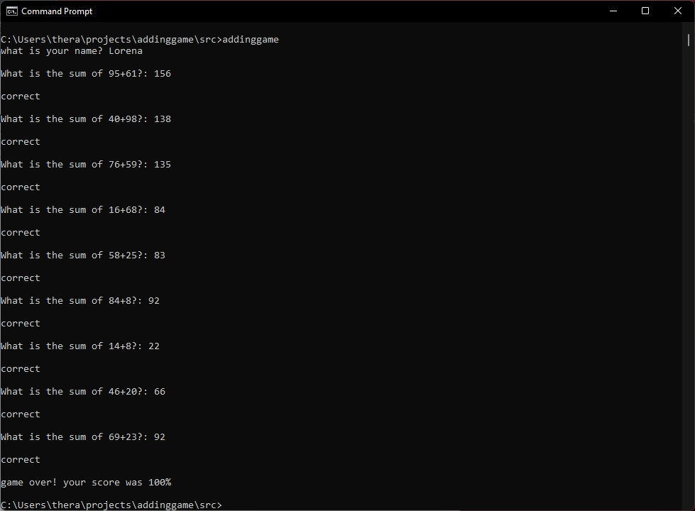
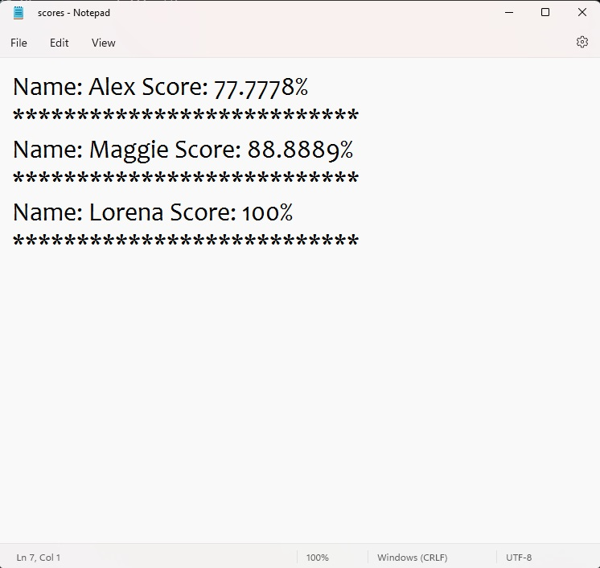

<h1 align="center">
	<a> Adding Game </a>
</h1>

	Description: The user is asked for their name and then given 10 randomized  two digit addition problems to solve. Upon completion the user is given their final score. The name and score are recorded in a text file.

Game example images:

